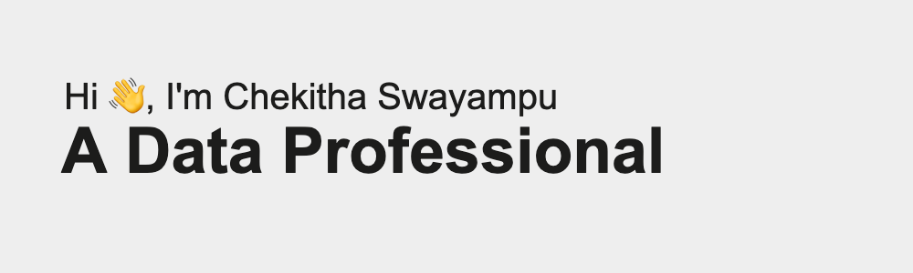

  

A recent Data Science graduate from George Washington University, blending machine learning, forecasting, and visualization to transform raw data into stories and solutions. Passionate about exploring new tools and methods, with a focus on turning complex datasets into insights that drive real-world impact.
 

## Tech Stack:
   
  

            

## GitHub Stats:

  
  
  

## Connect with me:

 
